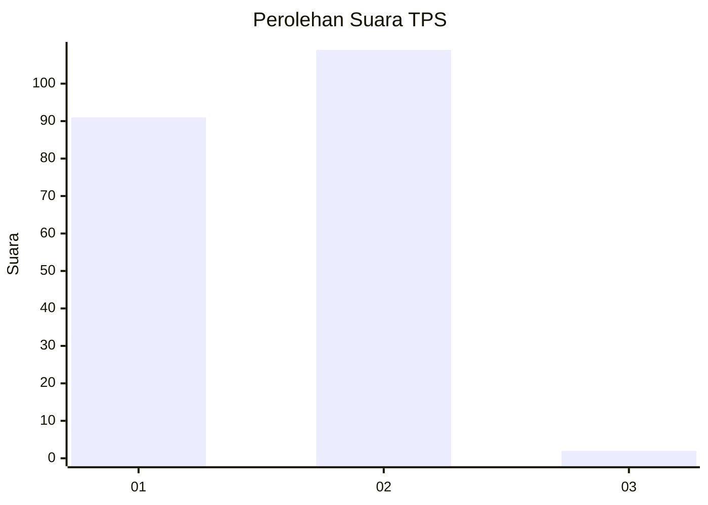
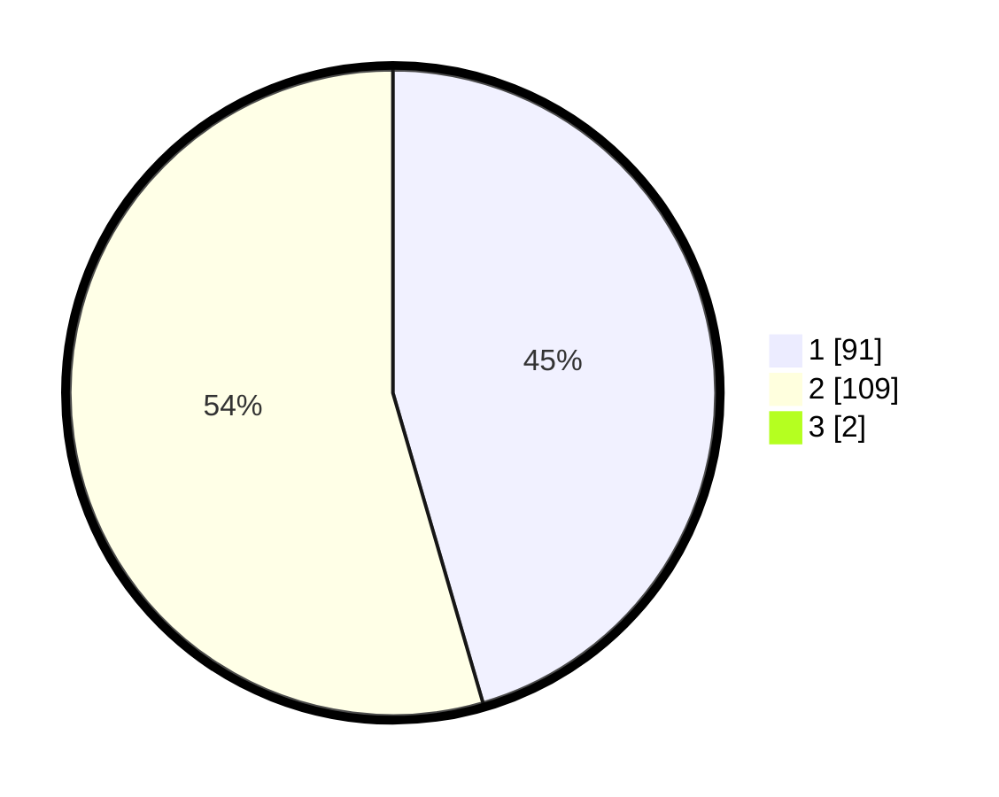

# Hasil

## Grafik

## Tabel

| No. | Nama Paslon    | Suara | Suara (raw) | Persentase |
|:--- |:-------------- | -----:| -----------:| ----------:|
| 1   | ANIES MUHAIMIN | 91    | [91][p-1]   | 45,05      |
| 2   | PRABOWO GIBRAN | 109   | [109][p-2]  | 53,96      |
| 3   | GANJAR MAHFUD  | 2     | [2][p-3]    | 0,99       |

[p-1]: https://github.com/gigit-pemilu/pemilu-2024-74-sulawesi-tenggara/blob/main/pilpres/hitung-suara/sub/74-sulawesi-tenggara/sub/71-kota-kendari/sub/10-kambu/sub/1001-kambu/sub/004-tps/sub/paslon-1.txt
[p-2]: https://github.com/gigit-pemilu/pemilu-2024-74-sulawesi-tenggara/blob/main/pilpres/hitung-suara/sub/74-sulawesi-tenggara/sub/71-kota-kendari/sub/10-kambu/sub/1001-kambu/sub/004-tps/sub/paslon-2.txt
[p-3]: https://github.com/gigit-pemilu/pemilu-2024-74-sulawesi-tenggara/blob/main/pilpres/hitung-suara/sub/74-sulawesi-tenggara/sub/71-kota-kendari/sub/10-kambu/sub/1001-kambu/sub/004-tps/sub/paslon-3.txt

## Foto C Plano

https://sirekap-obj-formc.kpu.go.id/0c45/pemilu/ppwp/74/71/10/10/01/7471101001004-20240215-061242--b0cd0301-c019-4a5c-9068-784c554fe86f.jpg

https://sirekap-obj-formc.kpu.go.id/0c45/pemilu/ppwp/74/71/10/10/01/7471101001004-20240215-061320--3002b882-b996-421d-b2ce-805c58dc838a.jpg

https://sirekap-obj-formc.kpu.go.id/0c45/pemilu/ppwp/74/71/10/10/01/7471101001004-20240215-061343--6ae04d8d-22fd-433a-96a5-171a474c65c4.jpg

## Metadata

| Key        | Value               |
| ---------- | ------------------- |
| Time Stamp | 2024-02-25 11:00:00 |

