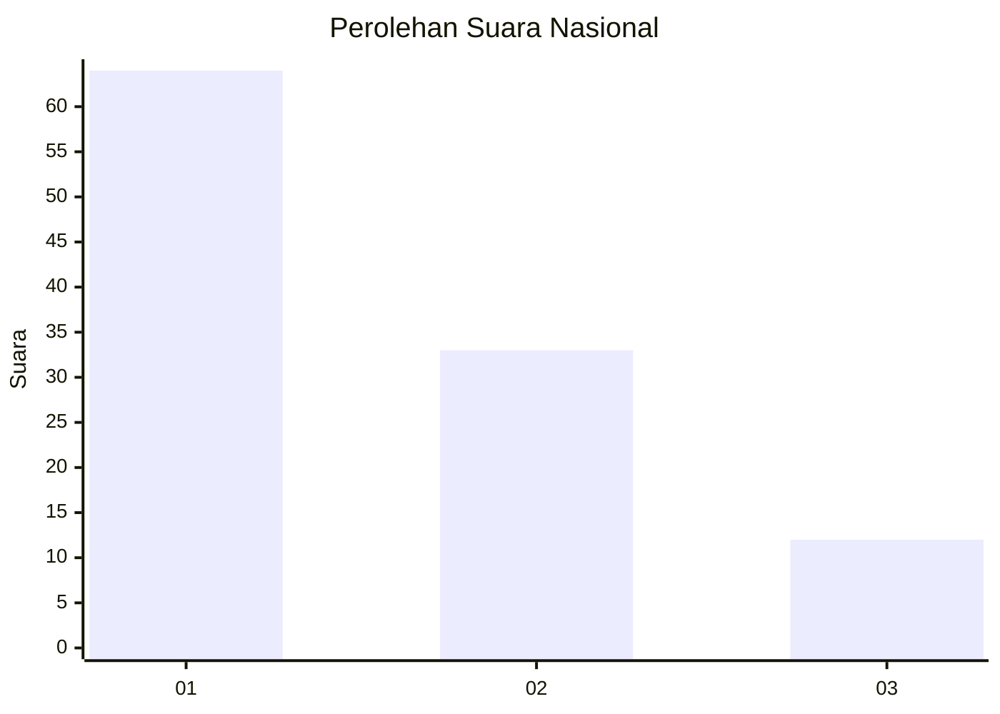
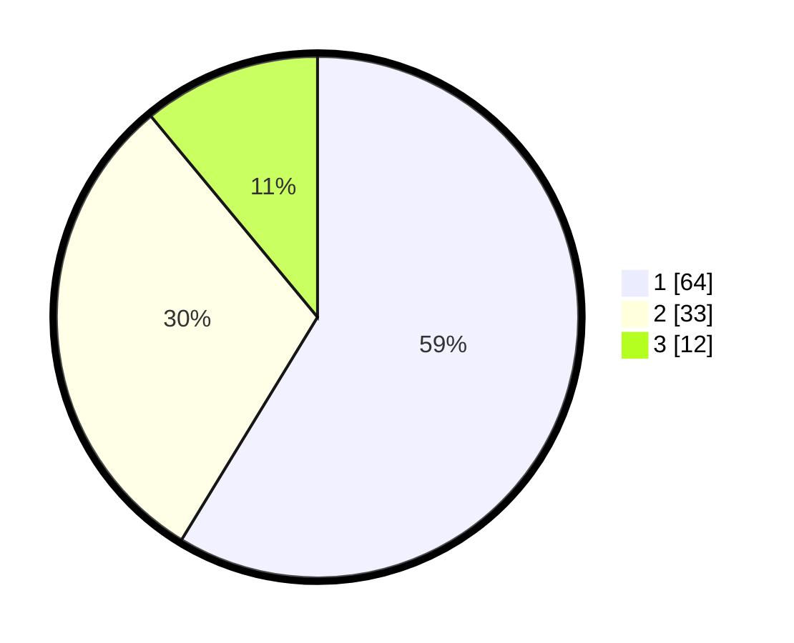

# Hasil

## Grafik

## Tabel

| No. | Nama Paslon    | Suara | Suara (raw) | Persentase |
|:--- |:-------------- | -----:| -----------:| ----------:|
| 1   | ANIES MUHAIMIN | 64    | [64][p-1]   | 58,72      |
| 2   | PRABOWO GIBRAN | 33    | [33][p-2]   | 30,28      |
| 3   | GANJAR MAHFUD  | 12    | [12][p-3]   | 11,01      |

[p-1]: https://github.com/gigit-pemilu/pemilu-2024/blob/main/pilpres/hitung-suara/sub/74-sulawesi-tenggara/sub/71-kota-kendari/sub/11-nambo/sub/1001-tobimeita/sub/003-tps/sub/paslon-1.txt
[p-2]: https://github.com/gigit-pemilu/pemilu-2024/blob/main/pilpres/hitung-suara/sub/74-sulawesi-tenggara/sub/71-kota-kendari/sub/11-nambo/sub/1001-tobimeita/sub/003-tps/sub/paslon-2.txt
[p-3]: https://github.com/gigit-pemilu/pemilu-2024/blob/main/pilpres/hitung-suara/sub/74-sulawesi-tenggara/sub/71-kota-kendari/sub/11-nambo/sub/1001-tobimeita/sub/003-tps/sub/paslon-3.txt

## Foto C Plano

https://sirekap-obj-formc.kpu.go.id/aadc/pemilu/ppwp/74/71/11/10/01/7471111001003-20240215-004043--6a8be309-876b-43ce-b683-7a661e651bb9.jpg

https://sirekap-obj-formc.kpu.go.id/aadc/pemilu/ppwp/74/71/11/10/01/7471111001003-20240215-010347--a80584d7-17fc-44ec-b4f7-12eb5739e884.jpg

https://sirekap-obj-formc.kpu.go.id/aadc/pemilu/ppwp/74/71/11/10/01/7471111001003-20240215-004219--e7854681-3008-4d66-b822-3b65f4075a49.jpg

## Metadata

| Key        | Value               |
| ---------- | ------------------- |
| Time Stamp | 2024-02-15 15:00:29 |

