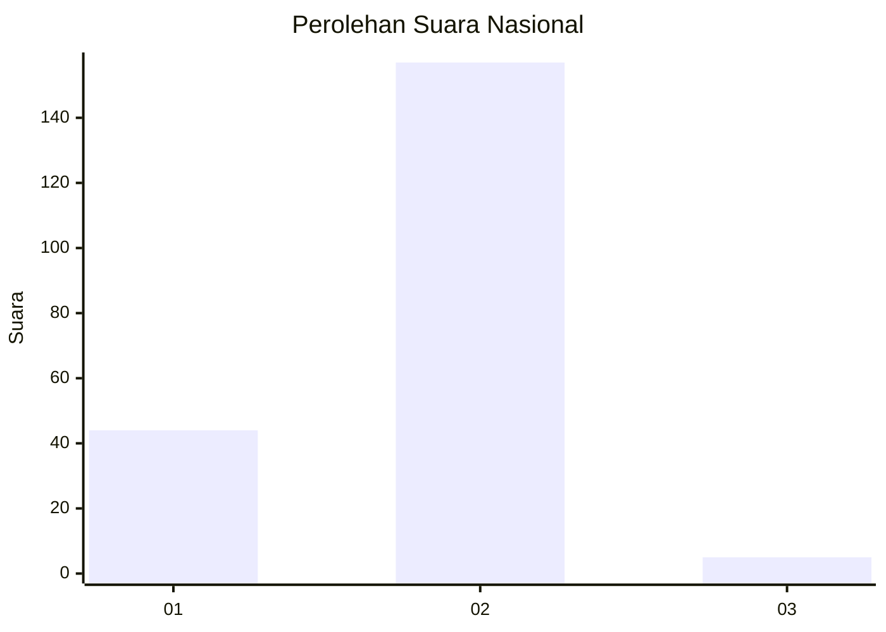
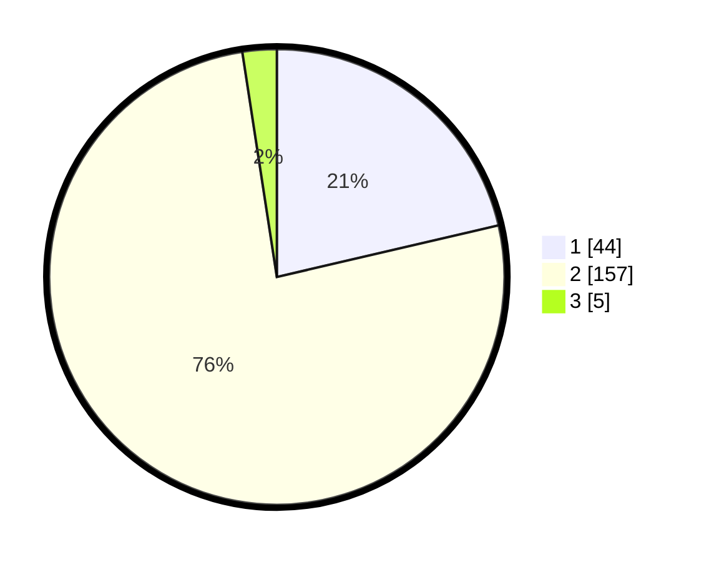

# Hasil

## Grafik

## Tabel

| No. | Nama Paslon    | Suara | Suara (raw) | Persentase |
|:--- |:-------------- | -----:| -----------:| ----------:|
| 1   | ANIES MUHAIMIN | 44    | [44][p-1]   | 21,36      |
| 2   | PRABOWO GIBRAN | 157   | [157][p-2]  | 76,21      |
| 3   | GANJAR MAHFUD  | 5     | [5][p-3]    | 2,43       |

[p-1]: https://github.com/gigit-pemilu/pemilu-2024/blob/main/pilpres/hitung-suara/sub/74-sulawesi-tenggara/sub/71-kota-kendari/sub/11-nambo/sub/1001-tobimeita/sub/004-tps/sub/paslon-1.txt
[p-2]: https://github.com/gigit-pemilu/pemilu-2024/blob/main/pilpres/hitung-suara/sub/74-sulawesi-tenggara/sub/71-kota-kendari/sub/11-nambo/sub/1001-tobimeita/sub/004-tps/sub/paslon-2.txt
[p-3]: https://github.com/gigit-pemilu/pemilu-2024/blob/main/pilpres/hitung-suara/sub/74-sulawesi-tenggara/sub/71-kota-kendari/sub/11-nambo/sub/1001-tobimeita/sub/004-tps/sub/paslon-3.txt

## Foto C Plano

https://sirekap-obj-formc.kpu.go.id/84a2/pemilu/ppwp/74/71/11/10/01/7471111001004-20240215-023023--c900bfda-8026-4bf6-a1c2-adc7ff9c42ab.jpg

https://sirekap-obj-formc.kpu.go.id/84a2/pemilu/ppwp/74/71/11/10/01/7471111001004-20240215-023125--33d44bba-c25d-4589-a86a-22092a8fa11f.jpg

https://sirekap-obj-formc.kpu.go.id/84a2/pemilu/ppwp/74/71/11/10/01/7471111001004-20240215-023308--afdae3f5-48ce-488b-9123-397fba7fb755.jpg

## Metadata

| Key        | Value               |
| ---------- | ------------------- |
| Time Stamp | 2024-02-24 22:31:28 |

