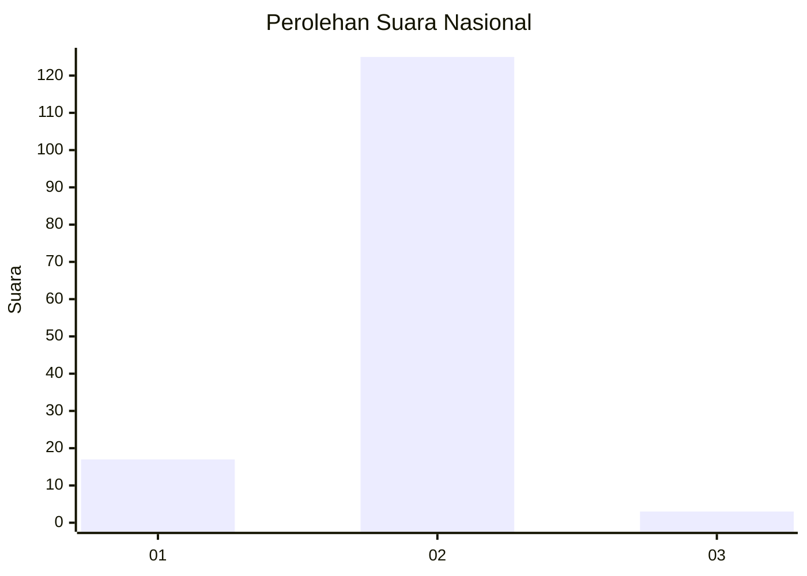
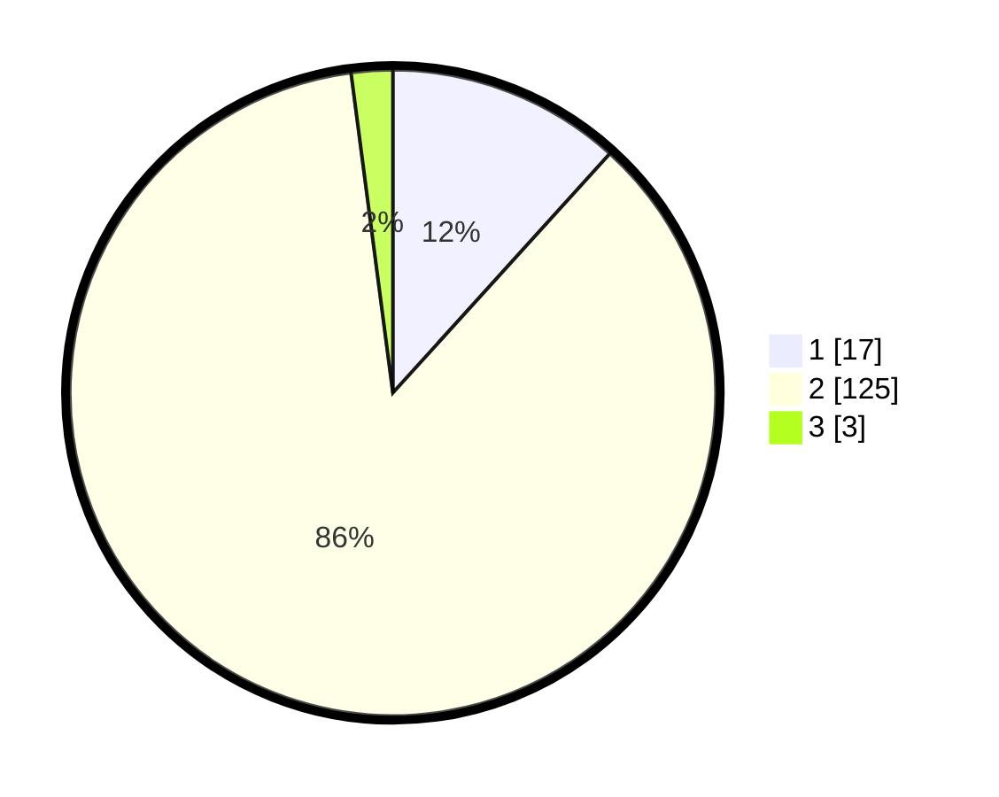

# Hasil

## Grafik

## Tabel

| No. | Nama Paslon    | Suara | Suara (raw) | Persentase |
|:--- |:-------------- | -----:| -----------:| ----------:|
| 1   | ANIES MUHAIMIN | 17    | [17][p-1]   | 11,72      |
| 2   | PRABOWO GIBRAN | 125   | [125][p-2]  | 86,21      |
| 3   | GANJAR MAHFUD  | 3     | [3][p-3]    | 2,07       |

[p-1]: https://github.com/gigit-pemilu/pemilu-2024/blob/main/pilpres/hitung-suara/sub/74-sulawesi-tenggara/sub/71-kota-kendari/sub/11-nambo/sub/1006-tondonggeu/sub/004-tps/sub/paslon-1.txt
[p-2]: https://github.com/gigit-pemilu/pemilu-2024/blob/main/pilpres/hitung-suara/sub/74-sulawesi-tenggara/sub/71-kota-kendari/sub/11-nambo/sub/1006-tondonggeu/sub/004-tps/sub/paslon-2.txt
[p-3]: https://github.com/gigit-pemilu/pemilu-2024/blob/main/pilpres/hitung-suara/sub/74-sulawesi-tenggara/sub/71-kota-kendari/sub/11-nambo/sub/1006-tondonggeu/sub/004-tps/sub/paslon-3.txt

## Foto C Plano

https://sirekap-obj-formc.kpu.go.id/cb45/pemilu/ppwp/74/71/11/10/06/7471111006004-20240214-232048--99ba6af2-a07d-48c9-85c6-712e9d8d1f26.jpg

https://sirekap-obj-formc.kpu.go.id/cb45/pemilu/ppwp/74/71/11/10/06/7471111006004-20240214-231733--d0fe23c6-a901-44d5-b92c-7e657f2c2ddb.jpg

https://sirekap-obj-formc.kpu.go.id/cb45/pemilu/ppwp/74/71/11/10/06/7471111006004-20240215-011512--551e11a5-d089-4ea1-980d-21960fc3e56c.jpg

## Metadata

| Key        | Value               |
| ---------- | ------------------- |
| Time Stamp | 2024-02-25 21:00:00 |

