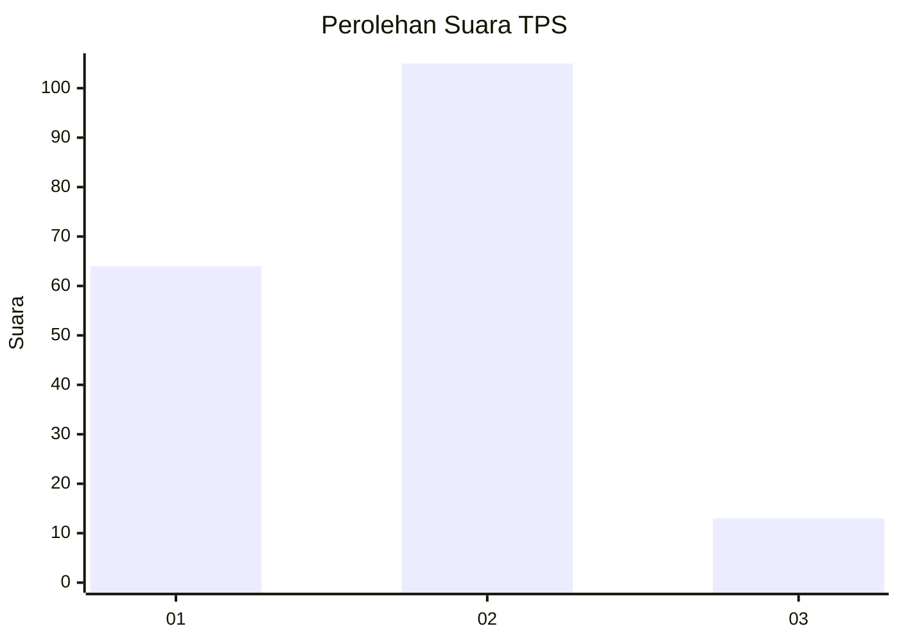
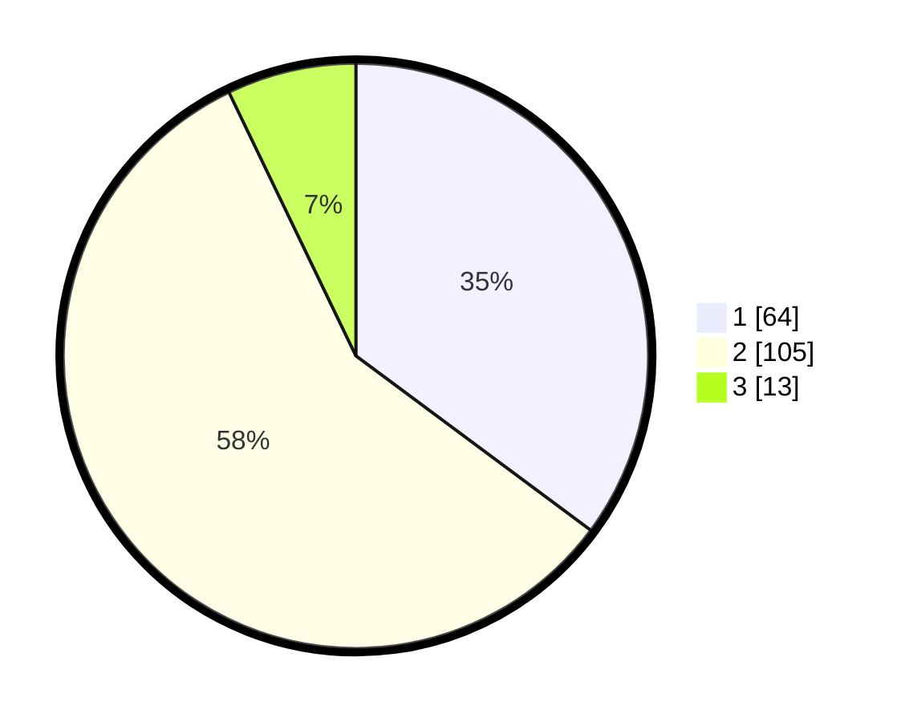

# Hasil

## Grafik

## Tabel

| No. | Nama Paslon    | Suara | Suara (raw) | Persentase |
|:--- |:-------------- | -----:| -----------:| ----------:|
| 1   | ANIES MUHAIMIN | 64    | [64][p-1]   | 35,16      |
| 2   | PRABOWO GIBRAN | 105   | [105][p-2]  | 57,69      |
| 3   | GANJAR MAHFUD  | 13    | [13][p-3]   | 7,14       |

[p-1]: https://github.com/gigit-pemilu/pemilu-2024-74-sulawesi-tenggara/blob/main/pilpres/hitung-suara/sub/74-sulawesi-tenggara/sub/72-kota-bau-bau/sub/01-betoambari/sub/1007-katobengke/sub/003-tps/sub/paslon-1.txt
[p-2]: https://github.com/gigit-pemilu/pemilu-2024-74-sulawesi-tenggara/blob/main/pilpres/hitung-suara/sub/74-sulawesi-tenggara/sub/72-kota-bau-bau/sub/01-betoambari/sub/1007-katobengke/sub/003-tps/sub/paslon-2.txt
[p-3]: https://github.com/gigit-pemilu/pemilu-2024-74-sulawesi-tenggara/blob/main/pilpres/hitung-suara/sub/74-sulawesi-tenggara/sub/72-kota-bau-bau/sub/01-betoambari/sub/1007-katobengke/sub/003-tps/sub/paslon-3.txt

## Foto C Plano

https://sirekap-obj-formc.kpu.go.id/aace/pemilu/ppwp/74/72/01/10/07/7472011007003-20240215-013536--09001e6d-8ade-495d-90c1-698e02787696.jpg

https://sirekap-obj-formc.kpu.go.id/aace/pemilu/ppwp/74/72/01/10/07/7472011007003-20240215-011331--5bd71106-e061-44ab-bc8d-31425f3c3d11.jpg

https://sirekap-obj-formc.kpu.go.id/aace/pemilu/ppwp/74/72/01/10/07/7472011007003-20240215-005909--ae1fbf72-e179-4e16-83d2-66918f32f533.jpg

## Metadata

| Key        | Value               |
| ---------- | ------------------- |
| Time Stamp | 2024-02-15 23:29:50 |

