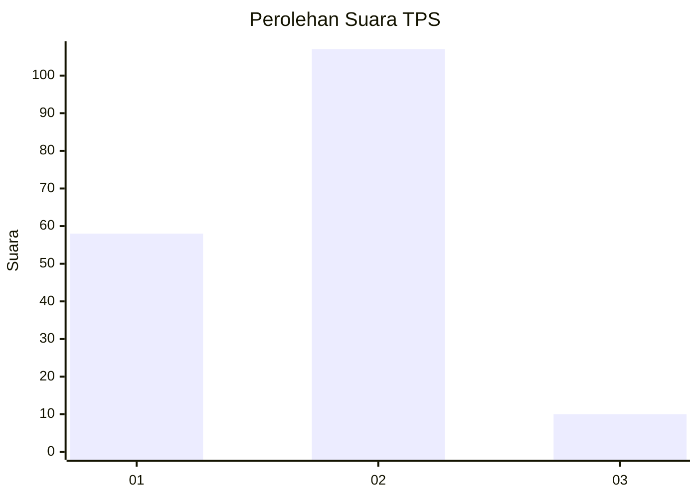
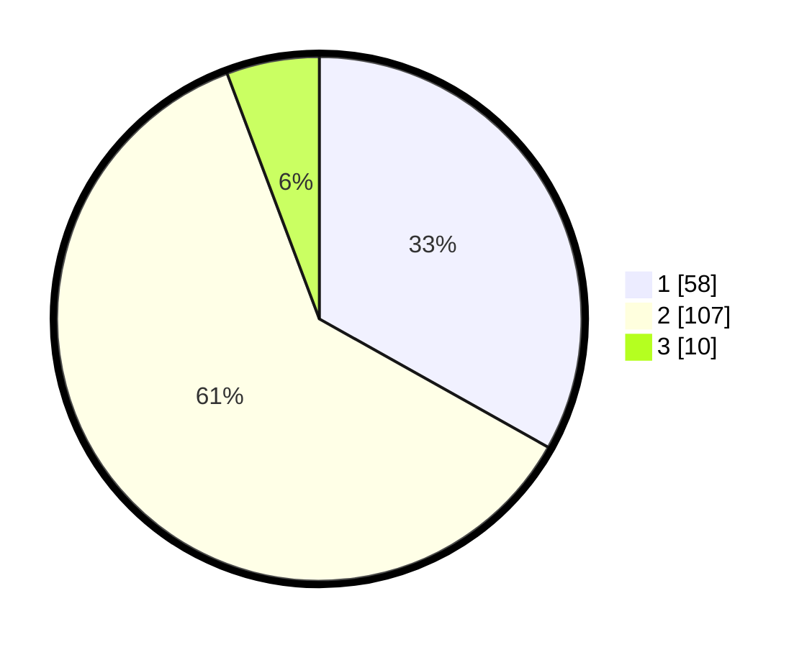

# Hasil

## Grafik

## Tabel

| No. | Nama Paslon    | Suara | Suara (raw) | Persentase |
|:--- |:-------------- | -----:| -----------:| ----------:|
| 1   | ANIES MUHAIMIN | 58    | [58][p-1]   | 33,14      |
| 2   | PRABOWO GIBRAN | 107   | [107][p-2]  | 61,14      |
| 3   | GANJAR MAHFUD  | 10    | [10][p-3]   | 5,71       |

[p-1]: https://github.com/gigit-pemilu/pemilu-2024-74-sulawesi-tenggara/blob/main/pilpres/hitung-suara/sub/74-sulawesi-tenggara/sub/72-kota-bau-bau/sub/01-betoambari/sub/1007-katobengke/sub/004-tps/sub/paslon-1.txt
[p-2]: https://github.com/gigit-pemilu/pemilu-2024-74-sulawesi-tenggara/blob/main/pilpres/hitung-suara/sub/74-sulawesi-tenggara/sub/72-kota-bau-bau/sub/01-betoambari/sub/1007-katobengke/sub/004-tps/sub/paslon-2.txt
[p-3]: https://github.com/gigit-pemilu/pemilu-2024-74-sulawesi-tenggara/blob/main/pilpres/hitung-suara/sub/74-sulawesi-tenggara/sub/72-kota-bau-bau/sub/01-betoambari/sub/1007-katobengke/sub/004-tps/sub/paslon-3.txt

## Foto C Plano

https://sirekap-obj-formc.kpu.go.id/20cf/pemilu/ppwp/74/72/01/10/07/7472011007004-20240215-001909--0dfd07ed-f382-4fb0-80b4-b85a21d77d1a.jpg

https://sirekap-obj-formc.kpu.go.id/20cf/pemilu/ppwp/74/72/01/10/07/7472011007004-20240215-002052--f131a6b4-c1eb-4687-80c0-1de4da86da89.jpg

https://sirekap-obj-formc.kpu.go.id/20cf/pemilu/ppwp/74/72/01/10/07/7472011007004-20240215-002230--cf7c6722-5b2e-44e5-9a89-1c6a40d91ce3.jpg

## Metadata

| Key        | Value               |
| ---------- | ------------------- |
| Time Stamp | 2024-02-15 22:40:13 |

