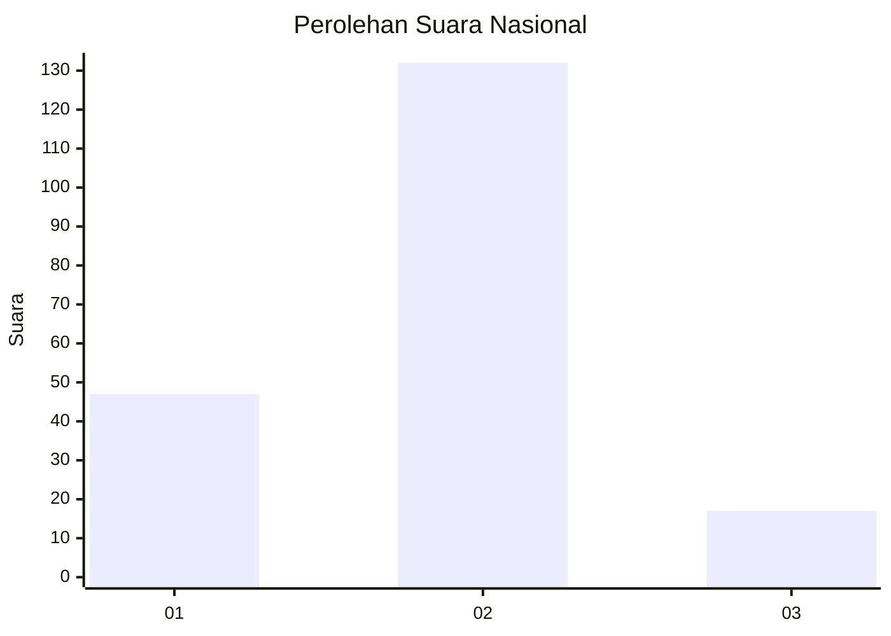
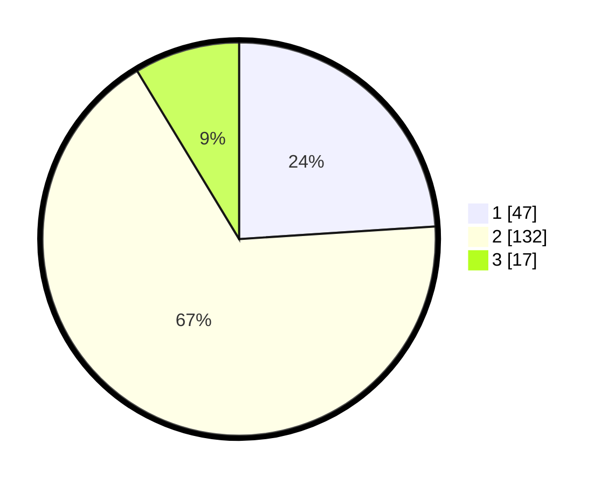

# Hasil

## Grafik

## Tabel

| No. | Nama Paslon    | Suara | Suara (raw) | Persentase |
|:--- |:-------------- | -----:| -----------:| ----------:|
| 1   | ANIES MUHAIMIN | 47    | [47][p-1]   | 23,98      |
| 2   | PRABOWO GIBRAN | 132   | [132][p-2]  | 67,35      |
| 3   | GANJAR MAHFUD  | 17    | [17][p-3]   | 8,67       |

[p-1]: https://github.com/gigit-pemilu/pemilu-2024/blob/main/pilpres/hitung-suara/sub/74-sulawesi-tenggara/sub/72-kota-bau-bau/sub/02-wolio/sub/1001-wale/sub/002-tps/sub/paslon-1.txt
[p-2]: https://github.com/gigit-pemilu/pemilu-2024/blob/main/pilpres/hitung-suara/sub/74-sulawesi-tenggara/sub/72-kota-bau-bau/sub/02-wolio/sub/1001-wale/sub/002-tps/sub/paslon-2.txt
[p-3]: https://github.com/gigit-pemilu/pemilu-2024/blob/main/pilpres/hitung-suara/sub/74-sulawesi-tenggara/sub/72-kota-bau-bau/sub/02-wolio/sub/1001-wale/sub/002-tps/sub/paslon-3.txt

## Foto C Plano

https://sirekap-obj-formc.kpu.go.id/0ef8/pemilu/ppwp/74/72/02/10/01/7472021001002-20240215-034107--c38eb7de-d53d-490b-b1f5-7ec1794b18bd.jpg

https://sirekap-obj-formc.kpu.go.id/0ef8/pemilu/ppwp/74/72/02/10/01/7472021001002-20240215-030528--29a0ccd5-e366-4dcd-a7fd-cee879560882.jpg

https://sirekap-obj-formc.kpu.go.id/0ef8/pemilu/ppwp/74/72/02/10/01/7472021001002-20240215-015800--bb12b6c4-7632-4499-b25e-1fe84bf59a81.jpg

## Metadata

| Key        | Value               |
| ---------- | ------------------- |
| Time Stamp | 2024-02-24 22:31:28 |

