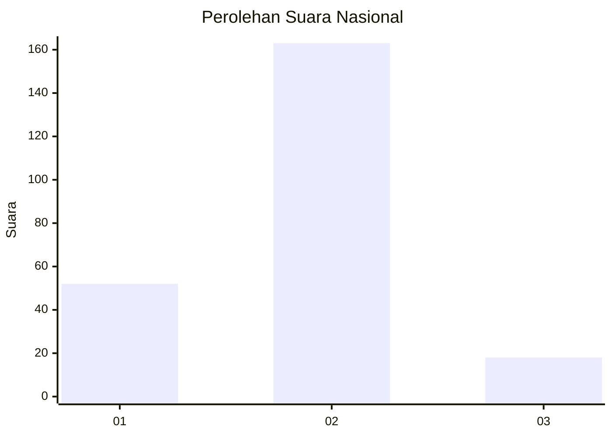
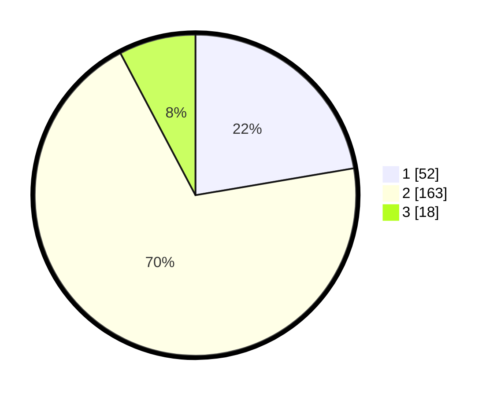

# Hasil

## Grafik

## Tabel

| No. | Nama Paslon    | Suara | Suara (raw) | Persentase |
|:--- |:-------------- | -----:| -----------:| ----------:|
| 1   | ANIES MUHAIMIN | 52    | [52][p-1]   | 22,32      |
| 2   | PRABOWO GIBRAN | 163   | [163][p-2]  | 69,96      |
| 3   | GANJAR MAHFUD  | 18    | [18][p-3]   | 7,73       |

[p-1]: https://github.com/gigit-pemilu/pemilu-2024/blob/main/pilpres/hitung-suara/sub/74-sulawesi-tenggara/sub/72-kota-bau-bau/sub/03-sorawolio/sub/1001-kaisabu-baru/sub/006-tps/sub/paslon-1.txt
[p-2]: https://github.com/gigit-pemilu/pemilu-2024/blob/main/pilpres/hitung-suara/sub/74-sulawesi-tenggara/sub/72-kota-bau-bau/sub/03-sorawolio/sub/1001-kaisabu-baru/sub/006-tps/sub/paslon-2.txt
[p-3]: https://github.com/gigit-pemilu/pemilu-2024/blob/main/pilpres/hitung-suara/sub/74-sulawesi-tenggara/sub/72-kota-bau-bau/sub/03-sorawolio/sub/1001-kaisabu-baru/sub/006-tps/sub/paslon-3.txt

## Foto C Plano

https://sirekap-obj-formc.kpu.go.id/1dcb/pemilu/ppwp/74/72/03/10/01/7472031001006-20240215-052153--0590d56b-5ac2-4ad4-8f89-4174545162e5.jpg

https://sirekap-obj-formc.kpu.go.id/1dcb/pemilu/ppwp/74/72/03/10/01/7472031001006-20240215-052225--5461e48a-ff9e-4602-94da-d81799ab70d6.jpg

https://sirekap-obj-formc.kpu.go.id/1dcb/pemilu/ppwp/74/72/03/10/01/7472031001006-20240215-052304--b77aaf46-cdf7-4178-9398-d4b06463fa13.jpg

## Metadata

| Key        | Value               |
| ---------- | ------------------- |
| Time Stamp | 2024-02-24 22:31:28 |

