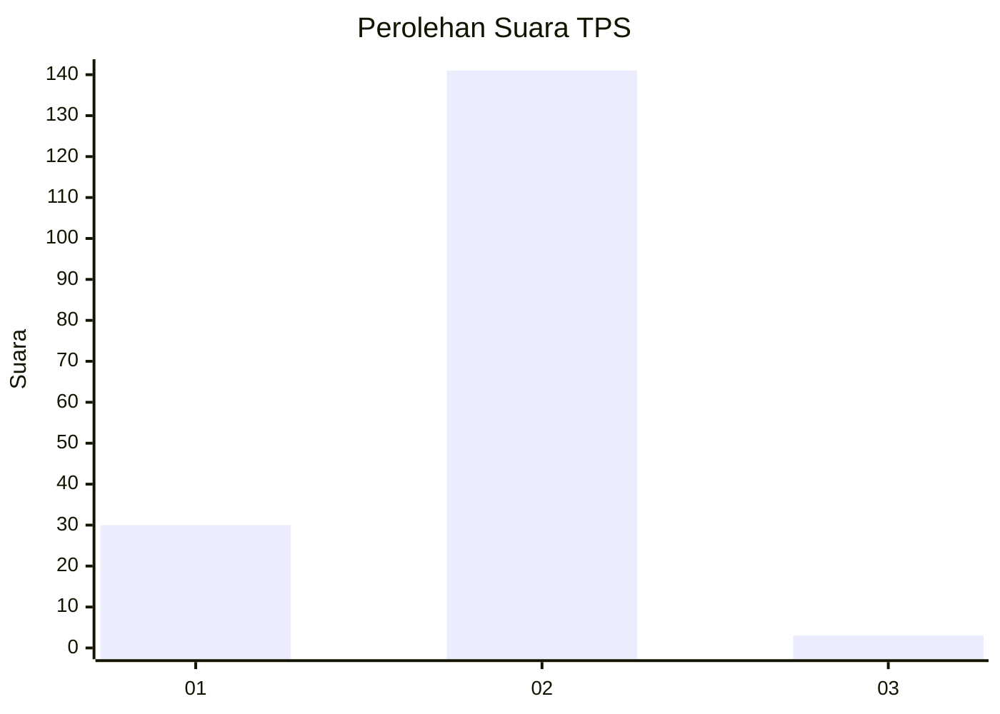
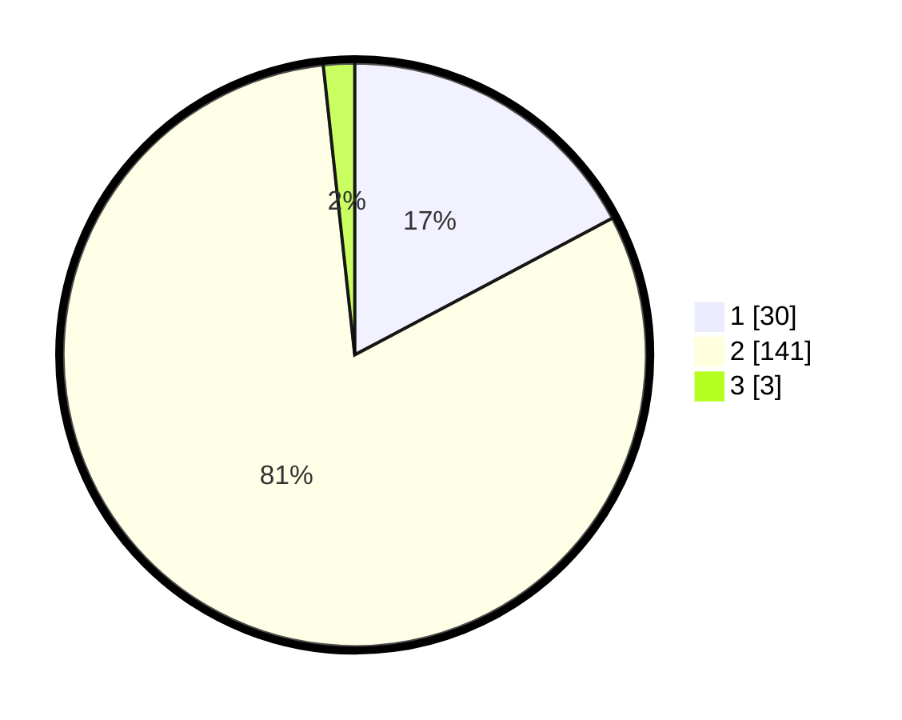

# Hasil

## Grafik

## Tabel

| No. | Nama Paslon    | Suara | Suara (raw) | Persentase |
|:--- |:-------------- | -----:| -----------:| ----------:|
| 1   | ANIES MUHAIMIN | 30    | [30][p-1]   | 17,24      |
| 2   | PRABOWO GIBRAN | 141   | [141][p-2]  | 81,03      |
| 3   | GANJAR MAHFUD  | 3     | [3][p-3]    | 1,72       |

[p-1]: https://github.com/gigit-pemilu/pemilu-2024-74-sulawesi-tenggara/blob/main/pilpres/hitung-suara/sub/74-sulawesi-tenggara/sub/72-kota-bau-bau/sub/05-kokalukuna/sub/1001-liwuto/sub/004-tps/sub/paslon-1.txt
[p-2]: https://github.com/gigit-pemilu/pemilu-2024-74-sulawesi-tenggara/blob/main/pilpres/hitung-suara/sub/74-sulawesi-tenggara/sub/72-kota-bau-bau/sub/05-kokalukuna/sub/1001-liwuto/sub/004-tps/sub/paslon-2.txt
[p-3]: https://github.com/gigit-pemilu/pemilu-2024-74-sulawesi-tenggara/blob/main/pilpres/hitung-suara/sub/74-sulawesi-tenggara/sub/72-kota-bau-bau/sub/05-kokalukuna/sub/1001-liwuto/sub/004-tps/sub/paslon-3.txt

## Foto C Plano

https://sirekap-obj-formc.kpu.go.id/e052/pemilu/ppwp/74/72/05/10/01/7472051001004-20240215-174448--0213bfbc-b584-40c8-8ada-1993d241ac98.jpg

https://sirekap-obj-formc.kpu.go.id/e052/pemilu/ppwp/74/72/05/10/01/7472051001004-20240215-174743--f7ad11b1-653d-4115-8784-11622ebea122.jpg

https://sirekap-obj-formc.kpu.go.id/e052/pemilu/ppwp/74/72/05/10/01/7472051001004-20240215-174853--ad69bd9e-97a3-4c9b-a2b7-c36c64789944.jpg

## Metadata

| Key        | Value               |
| ---------- | ------------------- |
| Time Stamp | 2024-02-24 22:31:28 |

