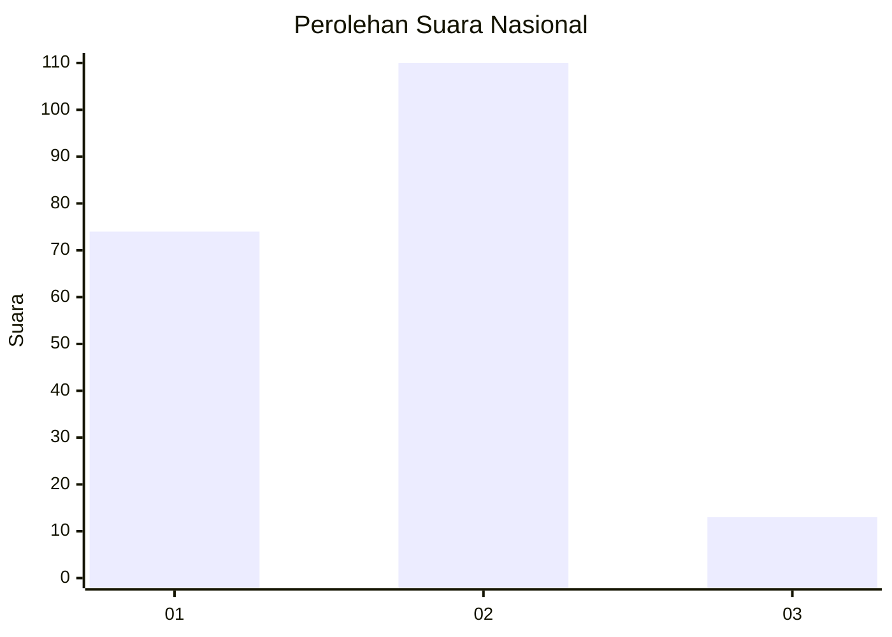
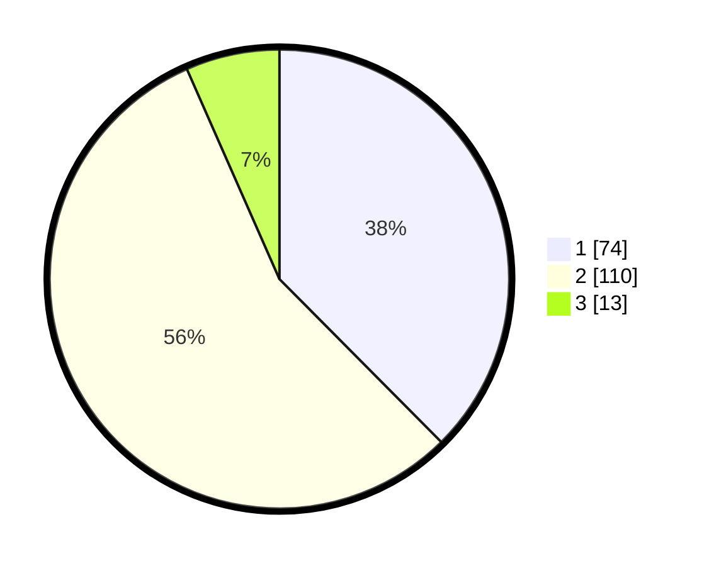

# Hasil

## Grafik

## Tabel

| No. | Nama Paslon    | Suara | Suara (raw) | Persentase |
|:--- |:-------------- | -----:| -----------:| ----------:|
| 1   | ANIES MUHAIMIN | 74    | [74][p-1]   | 37,56      |
| 2   | PRABOWO GIBRAN | 110   | [110][p-2]  | 55,84      |
| 3   | GANJAR MAHFUD  | 13    | [13][p-3]   | 6,60       |

[p-1]: https://github.com/gigit-pemilu/pemilu-2024/blob/main/pilpres/hitung-suara/sub/74-sulawesi-tenggara/sub/72-kota-bau-bau/sub/06-murhum/sub/1007-wajo/sub/002-tps/sub/paslon-1.txt
[p-2]: https://github.com/gigit-pemilu/pemilu-2024/blob/main/pilpres/hitung-suara/sub/74-sulawesi-tenggara/sub/72-kota-bau-bau/sub/06-murhum/sub/1007-wajo/sub/002-tps/sub/paslon-2.txt
[p-3]: https://github.com/gigit-pemilu/pemilu-2024/blob/main/pilpres/hitung-suara/sub/74-sulawesi-tenggara/sub/72-kota-bau-bau/sub/06-murhum/sub/1007-wajo/sub/002-tps/sub/paslon-3.txt

## Foto C Plano

https://sirekap-obj-formc.kpu.go.id/edc9/pemilu/ppwp/74/72/06/10/07/7472061007002-20240214-230329--1af6e2f9-688b-4047-a5b6-7b06642562b7.jpg

https://sirekap-obj-formc.kpu.go.id/edc9/pemilu/ppwp/74/72/06/10/07/7472061007002-20240214-230408--e77bc052-3d19-46b3-8cdb-9e01f81759b6.jpg

https://sirekap-obj-formc.kpu.go.id/edc9/pemilu/ppwp/74/72/06/10/07/7472061007002-20240214-225731--79870ff0-3b2b-4b63-9a28-8ed7d9b82b7a.jpg

## Metadata

| Key        | Value               |
| ---------- | ------------------- |
| Time Stamp | 2024-02-24 22:31:28 |

